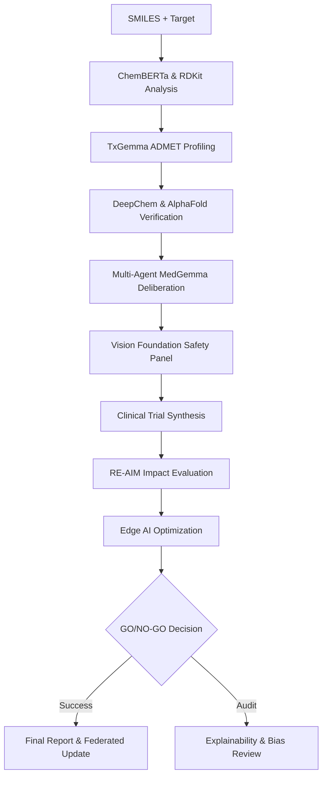

# 🏆 HAI-DEF Drug Discovery Pipeline

## End-to-End AI-Driven Therapeutic Discovery

This repository contains state-of-the-art drug discovery pipelines powered by **Google Health AI Developer Foundations (HAI-DEF)**. It integrates advanced language models, computer vision foundation models, and bio-molecular tools to accelerate the discovery of safe and effective therapeutics for any target disease.

---

## 🚀 Overview

The project features two primary incarnations of the discovery engine:

Kaggle Notebook

Full implementation available at: [[Kaggle Notebook Link](https://www.kaggle.com/code/uttarashah/universal-drug-pipelinehai-def?scriptVersionId=299607927)]

https://www.kaggle.com/code/uttarashah/medgemma-impact

Note: Due to competition rules and token security, the complete working notebook is maintained privately on Kaggle. This repository contains the architectural framework only.

---

## 🛠️ Integrated HAI-DEF Models

| Model | Role | Functional Coverage |
|---|---|---|
| **TxGemma-2B-Predict** | Therapeutic chemistry | ADMET profiling, Binding affinity, PK/PKD modeling |
| **MedGemma-4B-IT** | Clinical Intelligence | Multi-agent reasoning, Clinical trial design, Regulatory synthesis |
| **Path Foundation** | Histopathology | Tissue-level toxicity grading & necrosis risk |
| **CXR Foundation** | Pulmonary Safety | Automatic chest X-ray screening for drug-induced ILD |
| **Derm Foundation** | Cutaneous Safety | Dermatological reaction and photosensitivity risk |
| **MedSigLIP** | Multi-modal Alignment | Medical image-text similarity and clinical relevance |
| **ChemBERTa** | Molecular Foundation | Deep molecular embeddings and featurization |

---

## 🏗️ Pipeline Architecture

The system orchestrates a complex, multi-stage workflow from SMILES input to a final GO/NO-GO decision.



---

## ✨ Key Features

### 1. Multi-Agent Collaborative Discovery
Utilizes **MedGemma-4B** to simulate a collaborative panel of experts:
- **Medicinal Chemist**: Scaffold optimization and SAR.
- **Toxicologist**: Mechanistic safety and metabolic alerts.
- **Pharmacologist**: PK/DDI and distribution modeling.
- **Clinical Strategist**: Proof-of-concept trial design.

### 2. Bio-Molecular Foundations
Integrated support for deep bio-analysis:
- **AlphaFold-DB**: Autonomous retrieval of protein structures and binding site confidence.
- **DeepChem**: Benchmarking against Tox21 and MoleculeNet datasets.
- **SELFIES**: Robust molecular representations for generative exploration.

### 3. Comprehensive Safety Verification
Going beyond basic ADMET with HAI-DEF Vision models:
- **Tissue Safety**: Pathological review using Swin-based Path Foundation proxies.
- **Organ Safety**: Pulmonary (CXR) and Dermatological (Derm) foundation screening.

### 4. Public Health Impact (RE-AIM)
Automatic evaluation of the candidate's potential impact using the RE-AIM framework: **Reach, Effectiveness, Adoption, Implementation, and Maintenance**.

---

## 📦 Installation & Setup

### Requirements
- Python 3.10+
- PyTorch with CUDA (recommended) or CPU
- Hugging Face Token (with access to Google/Gemma models)

### Installation
```bash
pip install -q rdkit-pypi deepchem transformers accelerate bitsandbytes scipy selfies peft lightgbm xgboost
```

### Kaggle Execution
The pipelines are "Kaggle-friendly" and include a **SIMULATION Mode** that allows for scientific validation even without specialized GPU hardware or API tokens.

---

## 🧪 Usage

1.  Open the desired pipeline script.
2.  Configure your target in the `PIPELINE_CONFIG` block:
    ```python
    PIPELINE_CONFIG = {
        "disease": "Non-Small Cell Lung Cancer (NSCLC)",
        "target_protein": "EGFR",
        "therapeutic_area": "Oncology",
    }
    ```
3.  Add your candidate SMILES to the `COMPOUNDS` dictionary.
4.  Execute the script to run the 18-stage discovery process.

---

## 📱 Edge AI & Deployment
Includes built-in optimization for deployment in low-resource environments:
- **Model Compression**: Quantization for 4GB-6GB RAM devices.
- **Offline Capability**: 100% offline inference for rural health clinics.

---

## ⚖️ License & Disclaimer
*This tool is for research purposes only. AI-generated results must be validated by licensed medical and chemical professionals before clinical application.*
